# 바이브코딩 워크플로우 타임라인

## 📋 목차
- [인트로 & 영상 소개](#인트로--영상-소개)
- [발표자 소개 및 주제 제시](#발표자-소개-및-주제-제시)
- [시니어 개발자의 고충 & 문제 제기](#시니어-개발자의-고충--문제-제기)
- [바이브코딩 개념 정의](#바이브코딩-개념-정의)
- [단계별 워크플로우](#단계별-워크플로우)
- [추가 기능 데모](#추가-기능-데모)
- [조직 차원 적용 팁](#조직-차원-적용-팁)
- [Q&A](#qa)
- [마무리 & 크레딧](#마무리--크레딧)

## 인트로 & 영상 소개
**시간: 0:00 – 0:30**

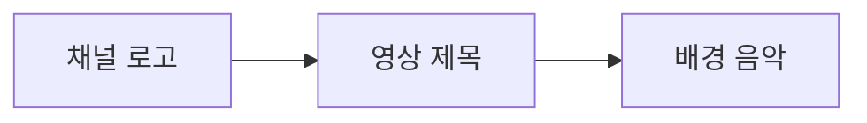

### 사용된 기술
- SVG 기반 벡터 애셋
- Adobe Premiere Pro / DaVinci Resolve
- BGM 삽입

## 발표자 소개 및 주제 제시
**시간: 0:30 – 1:30**

### 주요 내용
- 진행자: 로보코 수석 컨설턴트 정도현
- 주제: AI를 활용한 바이브코딩 워크플로우 시연

### 화면 구성
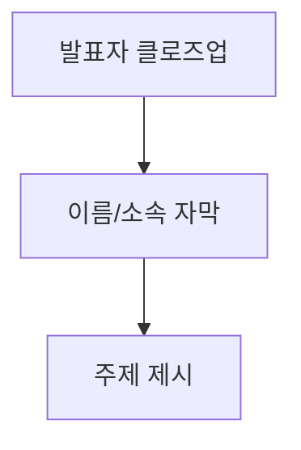

## 시니어 개발자의 고충 & 문제 제기
**시간: 1:30 – 3:00**

### 주요 문제점
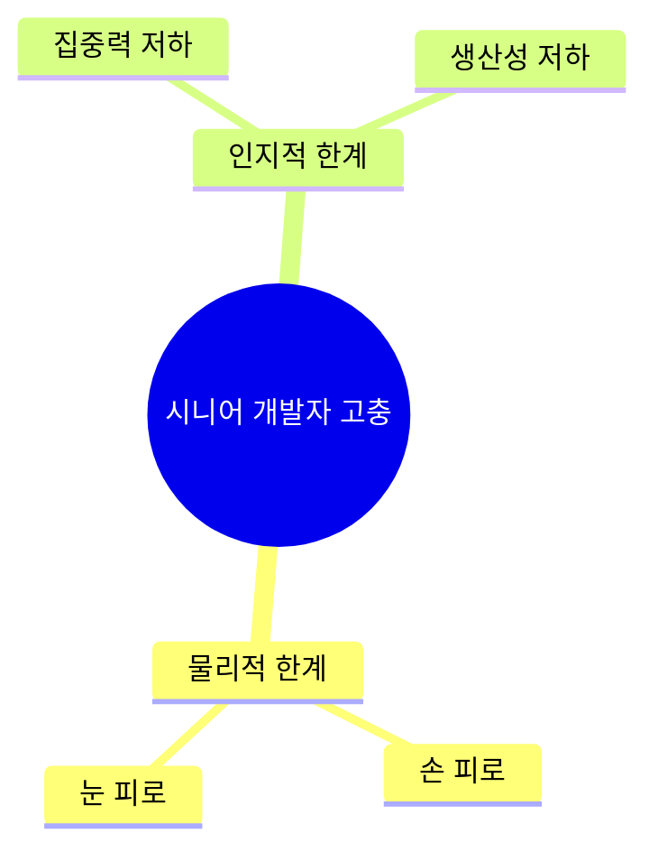

## 바이브코딩 개념 정의
**시간: 3:00 – 4:30**

### 바이브코딩 프로세스
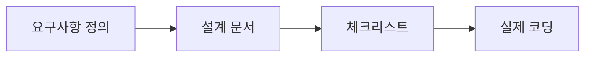

## 단계별 워크플로우

### 1. 요구사항 정의 (4:30 – 6:30)
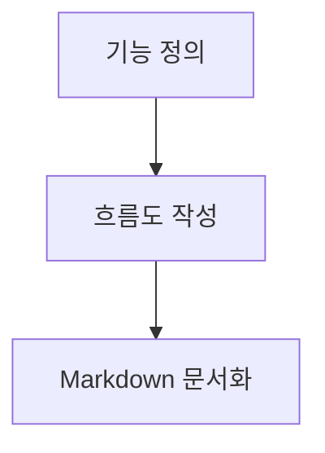

### 2. 설계 문서 작성 (6:30 – 8:30)
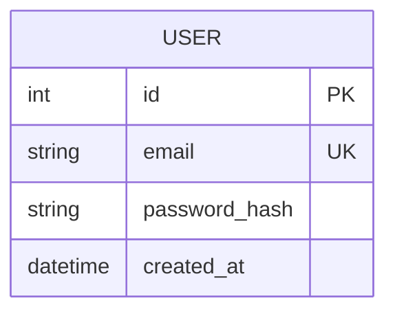

### 3. 체크리스트 작성 (8:30 – 10:30)
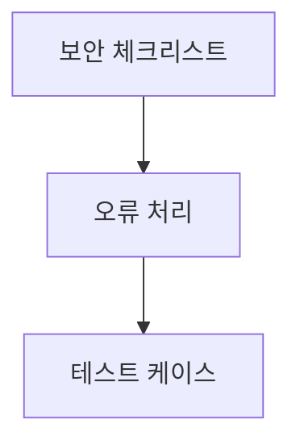

### 4. 실제 코딩 시연 (10:30 – 13:30)
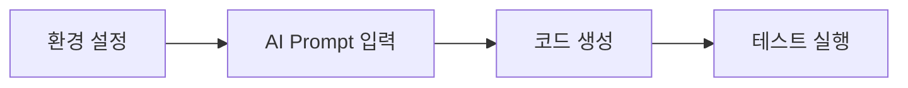

## 추가 기능 데모

### 인증 미들웨어 & 프로필 조회 (15:30 – 18:00)
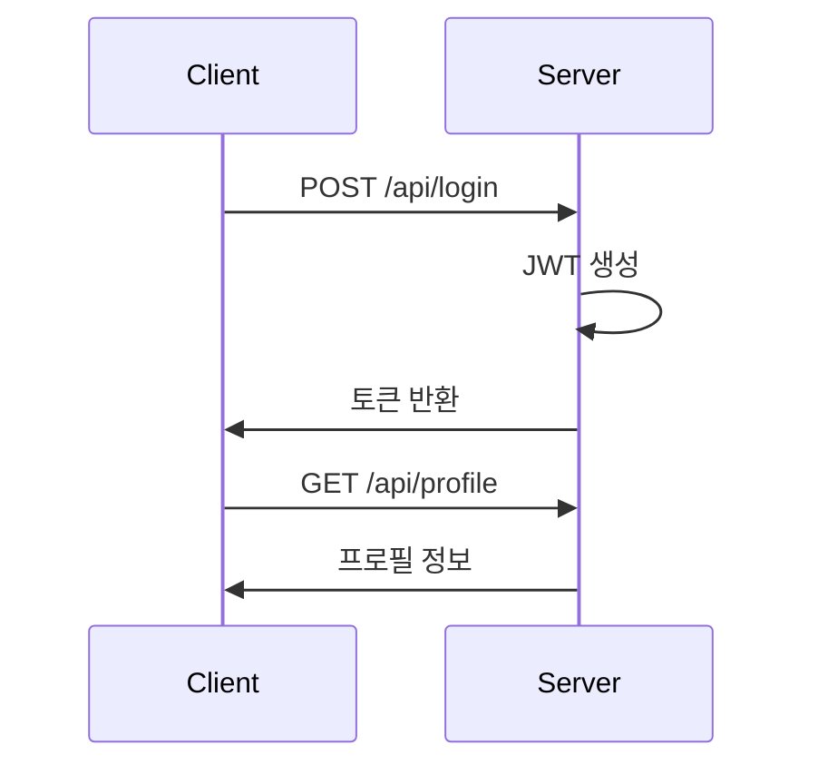

### 데이터베이스 연결 & ORM (18:00 – 20:00)
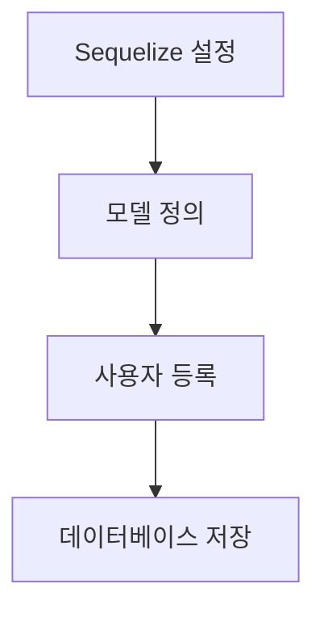

## 조직 차원 적용 팁

### Prompt 템플릿 관리 (22:00 – 23:00)
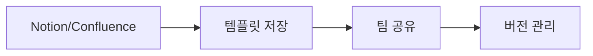

### 도구 추천 (23:00 – 24:30)
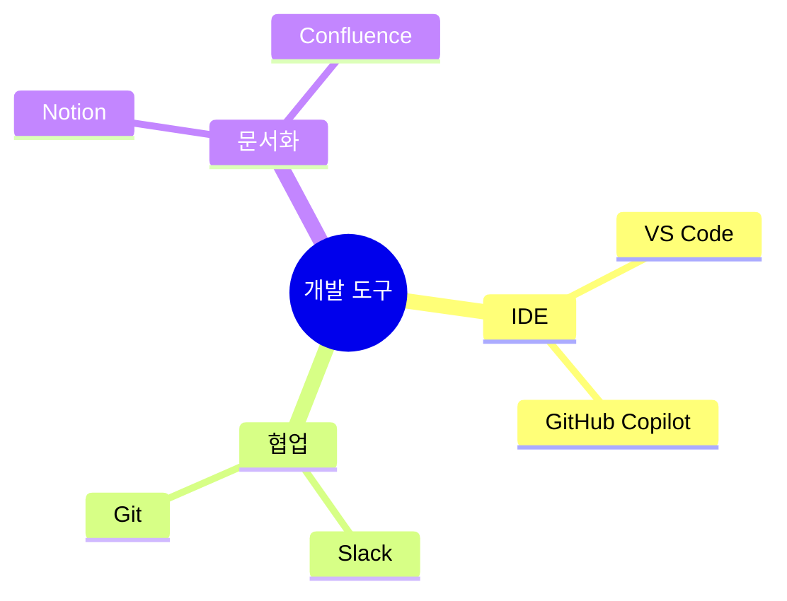

## Q&A
**시간: 24:30 – 26:30**

### 주요 질문
1. 바이브코딩 적용 범위
2. 보안 취약점 점검 방법

## 마무리 & 크레딧
**시간: 26:30 – 27:00**

### 영상 요약
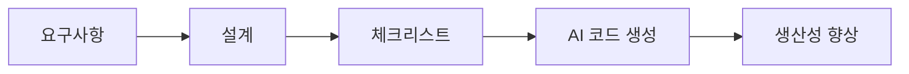

---
*© 2024 바이브코딩. All rights reserved.* 