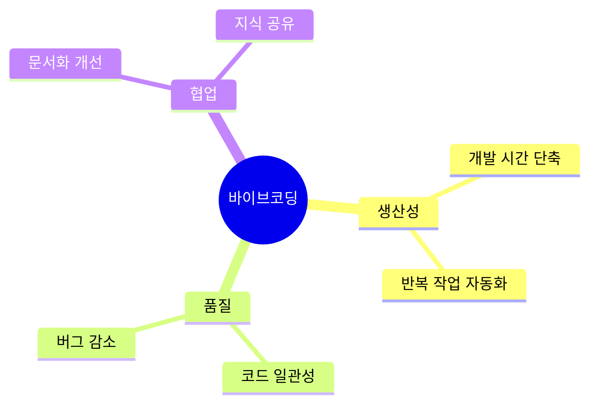
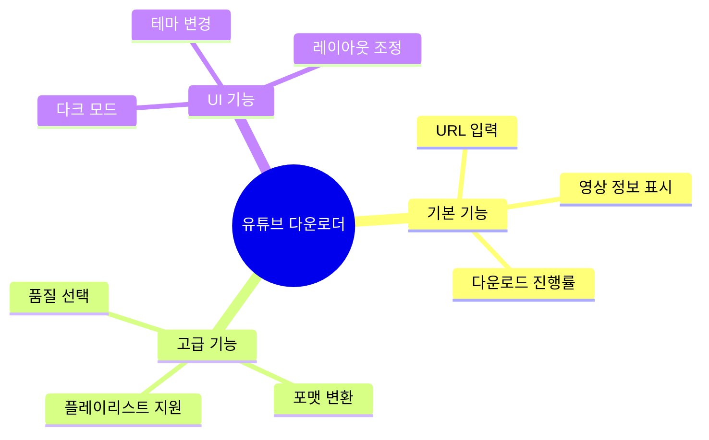
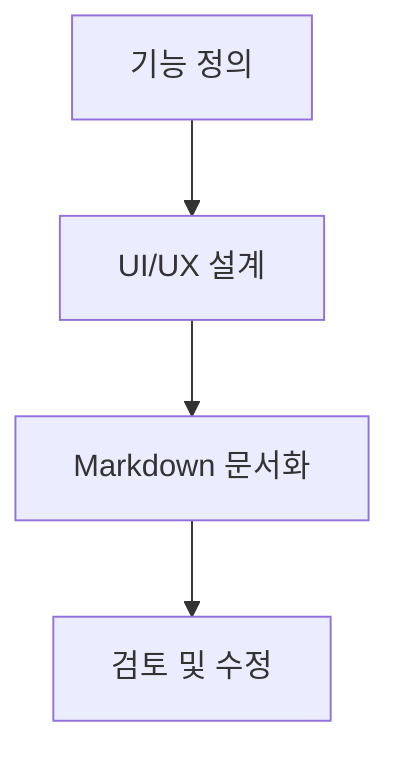
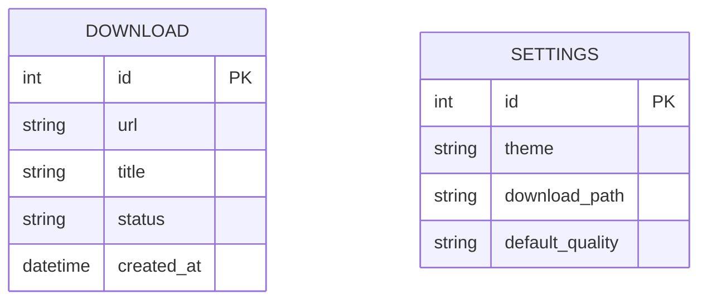
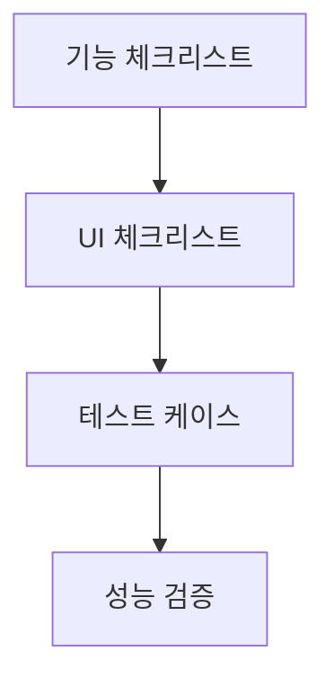
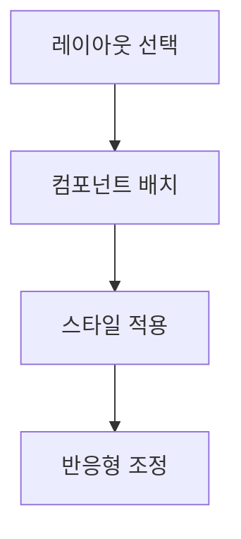

# 바이브코딩으로 GUI 프로그램 만들기


## 📋 강의 개요
- [바이브코딩이란?](#바이브코딩이란)
- [프로젝트 소개](#프로젝트-소개)
- [바이브코딩 프로세스](#바이브코딩-프로세스)
- [실습: 유튜브 다운로더 GUI 구현](#실습-유튜브-다운로더-gui-구현)
- [UI 커스터마이징](#ui-커스터마이징)
- [Q&A](#qa)

## 바이브코딩이란?

### 정의
바이브코딩은 AI 도구를 소프트웨어 개발 프로세스에 결합하여 개발 생산성과 품질을 향상시키는 방법론입니다.

### 핵심 가치


## 프로젝트 소개

### 목표
- Python과 PyQt를 사용한 GUI 프로그램 개발
- 유튜브 영상 다운로드 기능 구현
- 사용자 친화적인 UI 디자인

### 주요 기능


## 바이브코딩 프로세스

### 1. 요구사항 정의


### 2. 설계 문서 작성


### 3. 체크리스트 작성


### 4. AI 코드 생성


## 실습: 유튜브 다운로더 GUI 구현

### 1. 기본 UI 구현
```python
# main.py
import sys
from PyQt5.QtWidgets import QApplication, QMainWindow, QWidget, QVBoxLayout
from PyQt5.QtCore import Qt

class YouTubeDownloader(QMainWindow):
    def __init__(self):
        super().__init__()
        self.setWindowTitle("YouTube Downloader")
        self.setMinimumSize(800, 600)
        
        # 메인 위젯 설정
        main_widget = QWidget()
        self.setCentralWidget(main_widget)
        layout = QVBoxLayout(main_widget)
        
        # TODO: UI 컴포넌트 추가
```

### 2. 다운로드 기능 구현
```python
# downloader.py
import yt_dlp

class YouTubeDownloader:
    def __init__(self):
        self.ydl_opts = {
            'format': 'best',
            'outtmpl': '%(title)s.%(ext)s',
        }
    
    def download(self, url):
        with yt_dlp.YoutubeDL(self.ydl_opts) as ydl:
            ydl.download([url])
```

### 3. 진행률 표시
```python
# progress.py
from PyQt5.QtWidgets import QProgressBar
from PyQt5.QtCore import pyqtSignal

class DownloadProgress(QProgressBar):
    progress_updated = pyqtSignal(int)
    
    def __init__(self):
        super().__init__()
        self.setRange(0, 100)
        self.setTextVisible(True)
```

## UI 커스터마이징

### 1. 테마 시스템
```python
# themes.py
class ThemeManager:
    def __init__(self):
        self.themes = {
            'light': {
                'background': '#ffffff',
                'text': '#000000',
                'accent': '#007bff'
            },
            'dark': {
                'background': '#1a1a1a',
                'text': '#ffffff',
                'accent': '#0d6efd'
            }
        }
```

### 2. 스타일시트 예시
```css
/* style.qss */
QMainWindow {
    background-color: #ffffff;
}

QPushButton {
    background-color: #007bff;
    color: white;
    border: none;
    padding: 8px 16px;
    border-radius: 4px;
}

QLineEdit {
    padding: 8px;
    border: 1px solid #ced4da;
    border-radius: 4px;
}
```

### 3. 레이아웃 커스터마이징


## Q&A

### 자주 묻는 질문
1. **Q: PyQt와 Tkinter 중 어떤 것을 선택해야 하나요?**
   - A: PyQt가 더 현대적인 UI와 풍부한 기능을 제공합니다.

2. **Q: 다운로드 속도를 개선하는 방법은 무엇인가요?**
   - A: 멀티스레딩을 활용하고 다운로드 큐를 구현할 수 있습니다.

3. **Q: UI 테마를 동적으로 변경하는 방법은 무엇인가요?**
   - A: QSS 스타일시트를 실시간으로 로드하여 적용할 수 있습니다.

## 실습 자료

### 예제 코드
```python
# theme_switcher.py
class ThemeSwitcher:
    def __init__(self, main_window):
        self.main_window = main_window
        self.current_theme = 'light'
    
    def switch_theme(self, theme_name):
        if theme_name in self.themes:
            self.current_theme = theme_name
            self.apply_theme()
    
    def apply_theme(self):
        theme = self.themes[self.current_theme]
        self.main_window.setStyleSheet(f"""
            QMainWindow {{
                background-color: {theme['background']};
                color: {theme['text']};
            }}
        """)
```

### 체크리스트 템플릿
```markdown
## UI 체크리스트
- [ ] 반응형 레이아웃 구현
- [ ] 다크 모드 지원
- [ ] 다운로드 진행률 표시
- [ ] 에러 처리 및 사용자 피드백
- [ ] 단축키 지원
```

---
*© 2024 바이브코딩. All rights reserved.* 