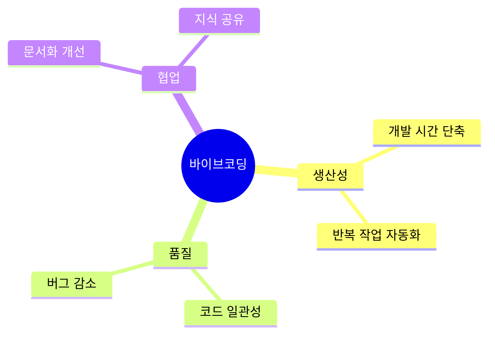
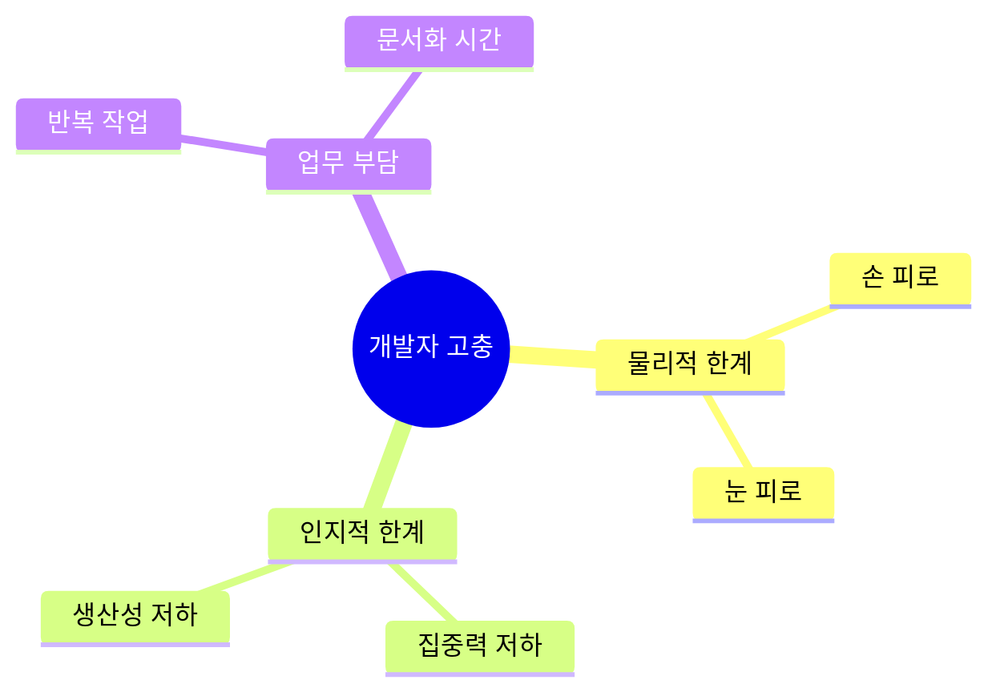
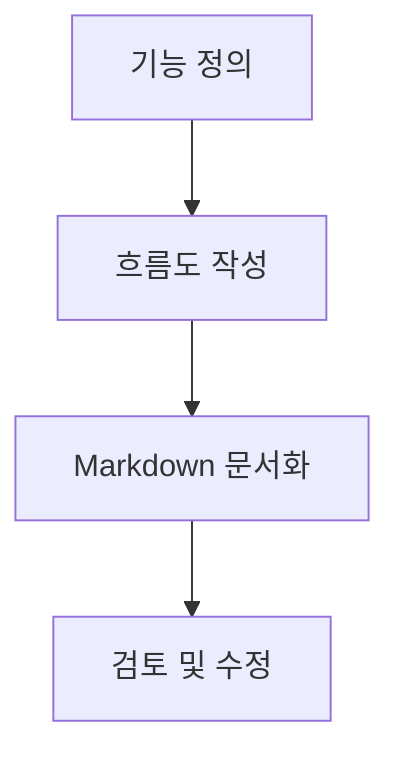
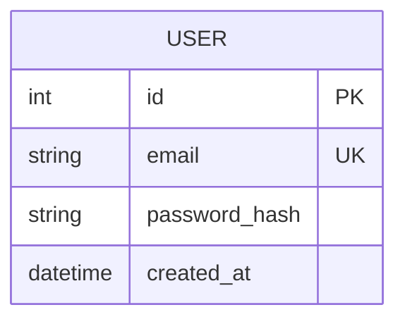
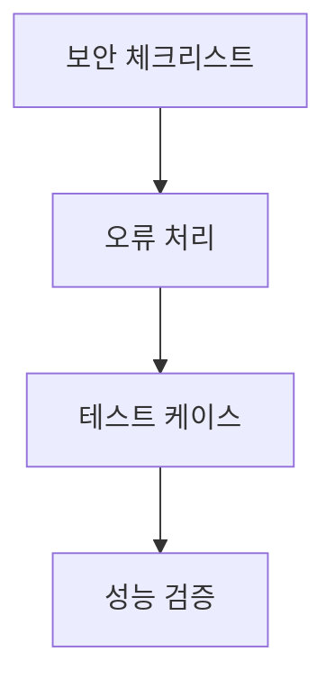
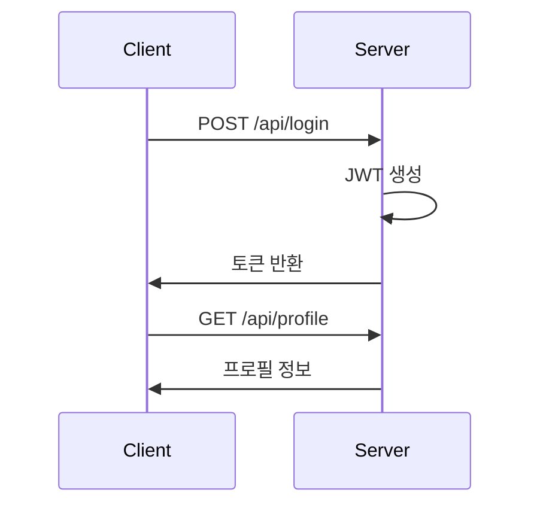
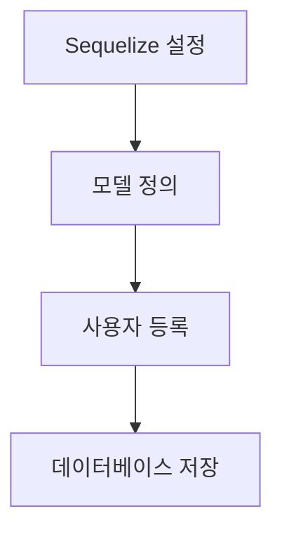
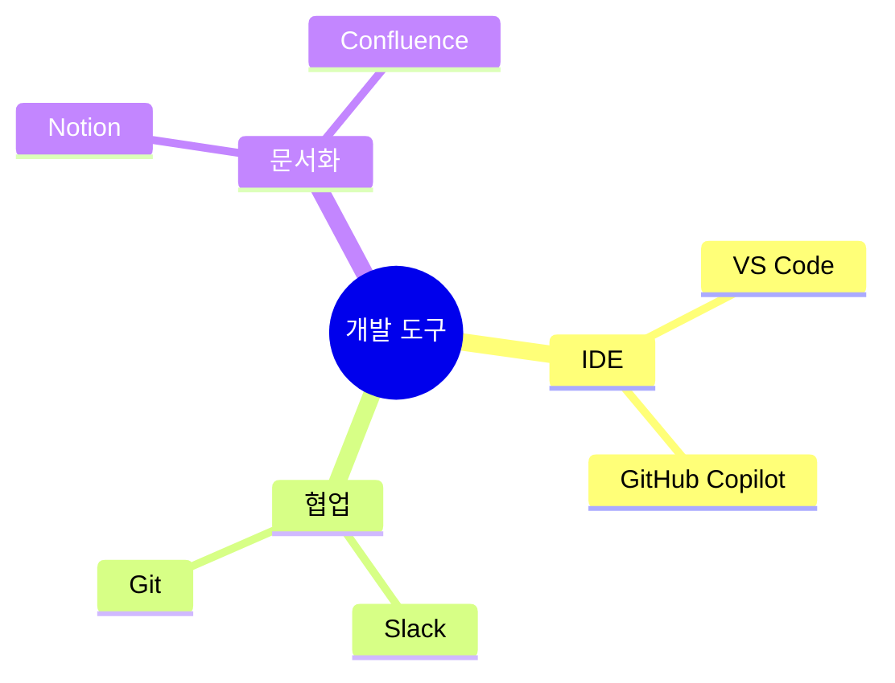

# 바이브코딩 워크플로우 강의 자료


## 📋 강의 개요
- [바이브코딩이란?](#바이브코딩이란)
- [시니어 개발자의 고충](#시니어-개발자의-고충)
- [바이브코딩 프로세스](#바이브코딩-프로세스)
- [실습: 사용자 인증 시스템 구현](#실습-사용자-인증-시스템-구현)
- [조직 적용 가이드](#조직-적용-가이드)
- [Q&A](#qa)

## 바이브코딩이란?

### 정의
바이브코딩은 AI 도구를 소프트웨어 개발 프로세스에 결합하여 개발 생산성과 품질을 향상시키는 방법론입니다.

### 핵심 가치


## 시니어 개발자의 고충

### 주요 문제점


## 바이브코딩 프로세스

### 1. 요구사항 정의


### 2. 설계 문서 작성


### 3. 체크리스트 작성


### 4. AI 코드 생성


## 실습: 사용자 인증 시스템 구현

### 1. 인증 프로세스


### 2. 데이터베이스 설계


### 3. 보안 구현
- JWT 토큰 기반 인증
- 비밀번호 해싱 (bcrypt)
- CORS 설정
- Helmet 미들웨어

## 조직 적용 가이드

### 1. Prompt 템플릿 관리


### 2. 도구 추천


### 3. 적용 단계
1. 소규모 프로젝트로 시작
2. 팀 내 교육 및 실습
3. 템플릿 및 가이드라인 수립
4. 전체 조직 확산

## Q&A

### 자주 묻는 질문
1. **Q: 바이브코딩을 모든 프로젝트에 적용해도 되나요?**
   - A: 프로젝트 규모와 도메인 복잡도에 따라 PoC 단계를 거쳐야 합니다.

2. **Q: AI가 생성한 코드의 보안은 어떻게 보장하나요?**
   - A: SAST 도구를 CI 파이프라인에 통합하여 자동화 검사를 수행합니다.

3. **Q: 팀 내 적용 시 주의할 점은 무엇인가요?**
   - A: 체계적인 교육과 템플릿 관리가 중요합니다.

## 실습 자료

### 예제 코드
```javascript
// 사용자 인증 미들웨어
const verifyToken = (req, res, next) => {
  const token = req.headers['authorization']?.split(' ')[1];
  if (!token) return res.status(401).json({ error: 'Token missing' });
  
  try {
    const decoded = jwt.verify(token, process.env.JWT_SECRET);
    req.user = decoded;
    next();
  } catch (err) {
    return res.status(403).json({ error: 'Invalid token' });
  }
};
```

### 체크리스트 템플릿
```markdown
## 보안 체크리스트
- [ ] 입력값 유효성 검사
- [ ] 비밀번호 해싱 적용
- [ ] JWT 만료 시간 설정
- [ ] CORS 설정
- [ ] Helmet 미들웨어 적용
```

---
*© 2024 바이브코딩. All rights reserved.* 