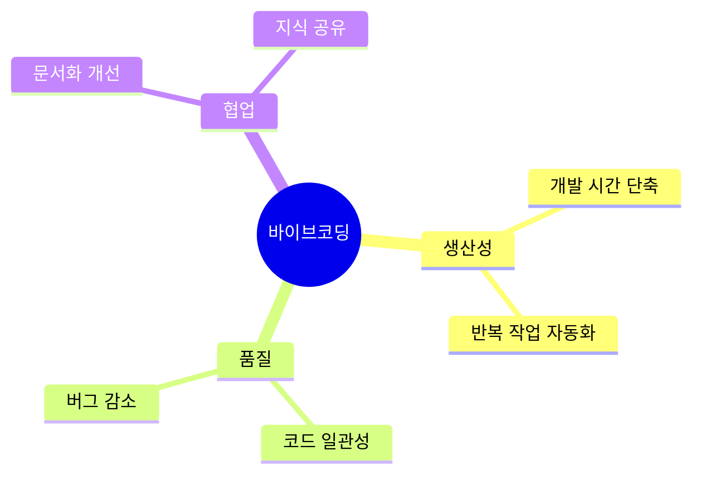
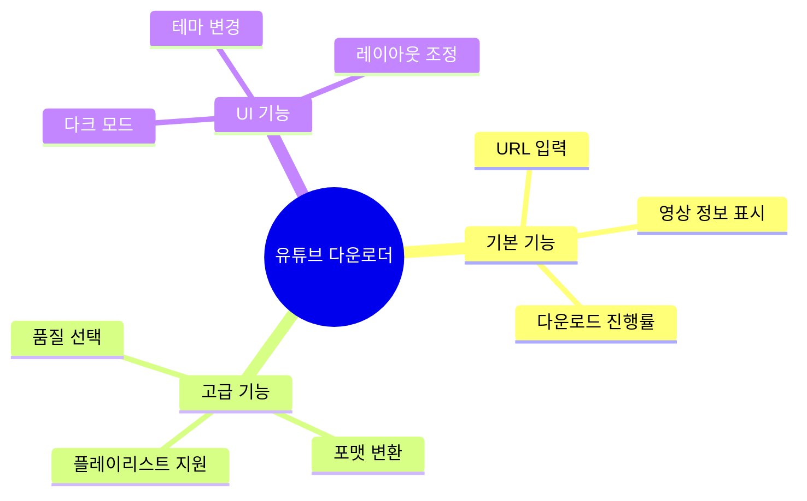
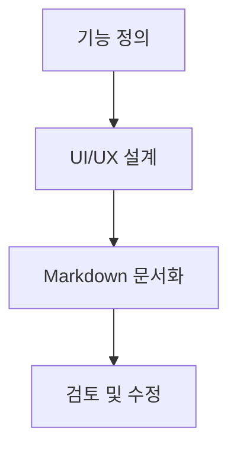
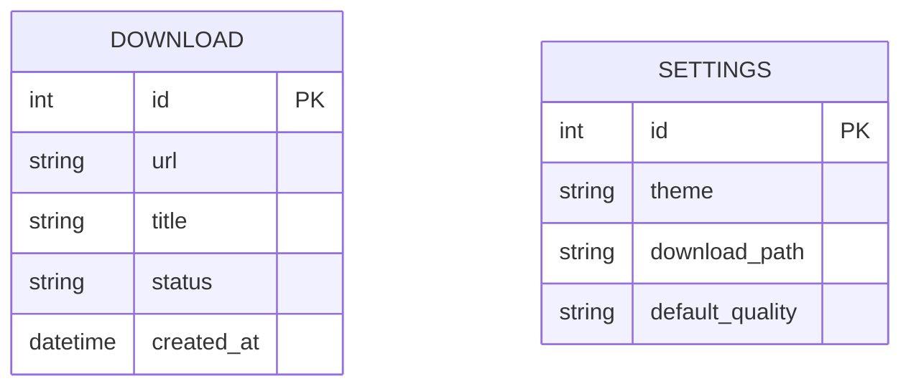
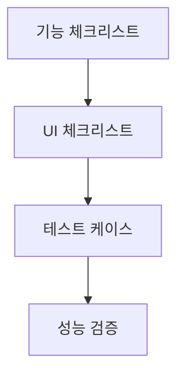
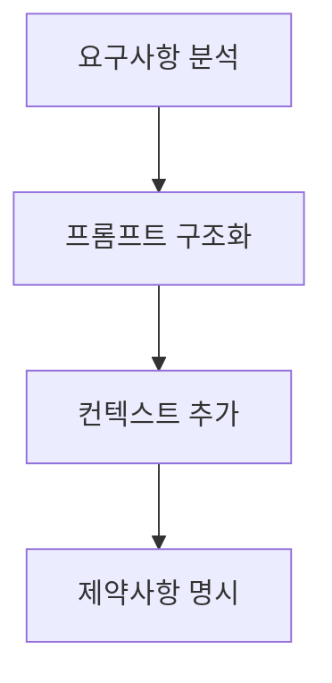
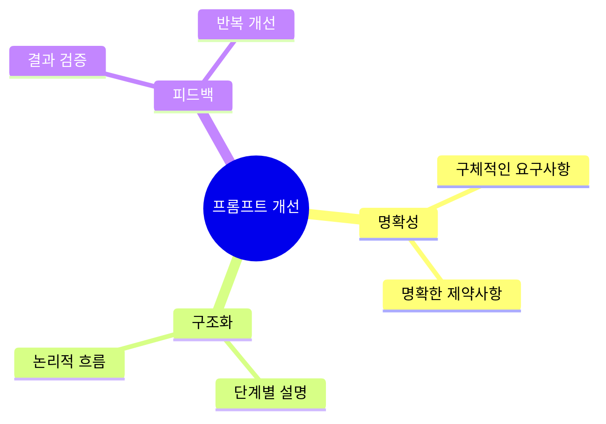

# 바이브코딩으로 GUI 프로그램 만들기


## 📋 강의 개요
- [바이브코딩이란?](#바이브코딩이란)
- [프로젝트 소개](#프로젝트-소개)
- [바이브코딩 프로세스](#바이브코딩-프로세스)
- [프롬프트 작성 가이드](#프롬프트-작성-가이드)
- [대화형 프롬프트 예시](#대화형-프롬프트-예시)
- [UI 수정 예시](#ui-수정-예시)
- [실습: 유튜브 다운로더 GUI](#실습-유튜브-다운로더-gui)
- [Q&A](#qa)

## 바이브코딩이란?

### 정의
바이브코딩은 AI 도구를 소프트웨어 개발 프로세스에 결합하여 개발 생산성과 품질을 향상시키는 방법론입니다.

### 핵심 가치


## 프로젝트 소개

### 목표
- Python과 PyQt를 사용한 GUI 프로그램 개발
- 유튜브 영상 다운로드 기능 구현
- 사용자 친화적인 UI 디자인

### 주요 기능


## 바이브코딩 프로세스

### 1. 요구사항 정의


### 2. 설계 문서 작성


### 3. 체크리스트 작성


## 프롬프트 작성 가이드

### 1. 기본 프롬프트 구조
```markdown
# 컨텍스트
- 프로젝트 목적: 유튜브 영상 다운로드 GUI 프로그램
- 사용 기술: Python, PyQt5
- 대상 사용자: 일반 사용자

# 요구사항
1. URL 입력 필드
2. 다운로드 버튼
3. 진행률 표시
4. 다운로드 목록

# 제약사항
- Python 3.8 이상
- PyQt5 사용
- yt-dlp 라이브러리 활용
```

### 2. UI 컴포넌트 프롬프트 예시
```markdown
# 메인 윈도우 레이아웃
- 윈도우 크기: 800x600
- 배경색: #ffffff
- 폰트: Noto Sans KR

# 컴포넌트 배치
1. 상단: URL 입력 필드 (QLineEdit)
2. 중앙: 다운로드 목록 (QListWidget)
3. 하단: 진행률 표시 (QProgressBar)

# 스타일 가이드
- 버튼: 둥근 모서리, 파란색 배경
- 입력 필드: 회색 테두리
- 진행률: 그라데이션 효과
```

### 3. 기능 구현 프롬프트 예시
```markdown
# 다운로드 기능
- 입력: 유튜브 URL
- 출력: 로컬 파일
- 옵션:
  * 품질 선택 (720p, 1080p)
  * 포맷 선택 (mp4, mp3)
  * 저장 경로 지정

# 에러 처리
- 잘못된 URL
- 네트워크 오류
- 저장 공간 부족

# 진행률 업데이트
- 다운로드 시작: 0%
- 진행 중: 실시간 업데이트
- 완료: 100%
```

## 대화형 프롬프트 예시

아래와 같이 자연스럽게 원하는 기능을 대화하듯 요청해도 AI가 충분히 이해할 수 있습니다.

```
PyQt5로 유튜브 다운로더를 만들고 싶어요.
- 사용자가 URL을 입력하면 다운로드가 시작되고,
- 다운로드 진행 상황을 0~100%로 보여주는 진행률 바가 있었으면 좋겠어요.
- 다운로드가 끝나면 완료 알림도 띄워주세요.
- 버튼 색상은 파란색으로 해주세요.
초보자도 이해할 수 있게 코드와 설명을 함께 제공해 주세요.
```

또는

```
PyQt5로 유튜브 영상 다운로드 프로그램을 만들고 싶어요.
진행률 바와 다운로드 완료 알림, 파란색 버튼이 포함된 예제 코드를 설명과 함께 보여주세요.
```

이처럼 자연스럽고 구체적으로 원하는 기능을 나열하는 것이 초보자에게 훨씬 쉽고, AI도 충분히 이해할 수 있습니다.

## UI 수정 예시

바이브코딩 프롬프트로 쉽게 요청할 수 있는 UI 수정 기능 예시입니다.

### 1. 버튼 색상/스타일 변경
```
다운로드 버튼을 파란색(#007bff)으로 바꿔주세요. 버튼 모서리는 둥글게 해주세요.
```

### 2. SVG 아이콘 적용
```
다운로드 버튼에 SVG 형식의 다운로드 아이콘을 추가해 주세요. 아이콘 색상은 흰색으로 해주세요.
```

### 3. 테마(다크/라이트) 지원
```
프로그램에 다크 모드와 라이트 모드를 추가해 주세요. 사용자가 테마를 선택할 수 있게 해주세요.
```

### 4. 레이아웃 변경
```
다운로드 목록을 창의 오른쪽에, 진행률 바는 하단에 배치해 주세요.
```

### 5. 폰트/텍스트 스타일 변경
```
전체 UI의 폰트를 Noto Sans KR로 바꿔주세요. 제목은 굵게, 본문은 보통 두께로 해주세요.
```

이처럼 원하는 UI 변경 사항을 자연스럽게 프롬프트로 요청하면, AI가 코드와 함께 쉽게 구현 방법을 안내해줍니다.

## 실습: 유튜브 다운로더 GUI

### 1. 프롬프트 작성 단계


### 2. 프롬프트 개선 방법


### 3. 프롬프트 템플릿
```markdown
# [컴포넌트명] 구현
## 목적
[이 컴포넌트가 해결할 문제]

## 요구사항
1. [기능 1]
2. [기능 2]
3. [기능 3]

## 제약사항
- [기술적 제약]
- [성능 요구사항]
- [UI/UX 가이드라인]

## 예상 동작
1. [사용자 액션 1]
2. [시스템 응답 1]
3. [사용자 액션 2]
4. [시스템 응답 2]
```

## Q&A

### 자주 묻는 질문
1. **Q: 프롬프트를 더 효과적으로 작성하는 방법은 무엇인가요?**
   - A: 구체적인 요구사항과 제약사항을 명확히 하고, 예상되는 결과를 상세히 설명하는 것이 중요합니다.

2. **Q: AI가 생성한 코드를 어떻게 검증하나요?**
   - A: 단위 테스트 케이스를 포함한 프롬프트를 작성하고, 생성된 코드의 각 부분이 요구사항을 만족하는지 확인합니다.

3. **Q: 복잡한 기능을 구현할 때는 어떻게 프롬프트를 작성하나요?**
   - A: 기능을 작은 단위로 분해하고, 각 단위별로 프롬프트를 작성한 후 점진적으로 통합하는 방식을 사용합니다.

## 실습 자료

### 프롬프트 예시
```markdown
# 다운로드 진행률 표시 구현
## 목적
사용자에게 다운로드 진행 상황을 시각적으로 보여주기

## 요구사항
1. 0-100% 범위의 진행률 표시
2. 현재 다운로드 속도 표시
3. 예상 남은 시간 표시
4. 다운로드 완료 시 알림

## 제약사항
- PyQt5 QProgressBar 사용
- 1초마다 업데이트
- 메인 스레드 블로킹 방지

## 예상 동작
1. 다운로드 시작 시 0% 표시
2. 진행 중 실시간 업데이트
3. 완료 시 100% 및 알림 표시
```

### 체크리스트 템플릿
```markdown
## 프롬프트 체크리스트
- [ ] 목적이 명확한가?
- [ ] 요구사항이 구체적인가?
- [ ] 제약사항이 명시되어 있는가?
- [ ] 예상 동작이 상세한가?
- [ ] 테스트 케이스가 포함되어 있는가?
```

---
*© 2024 바이브코딩. All rights reserved.* 